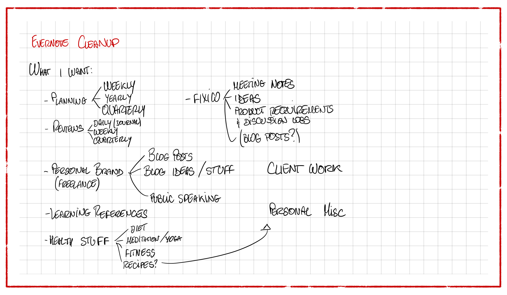
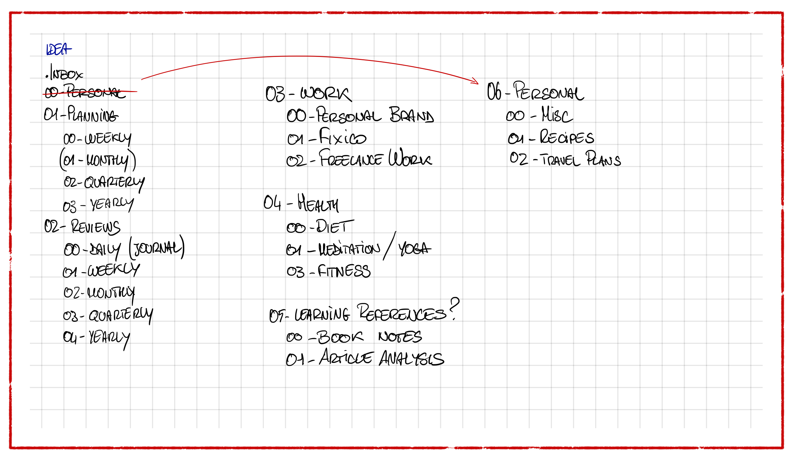
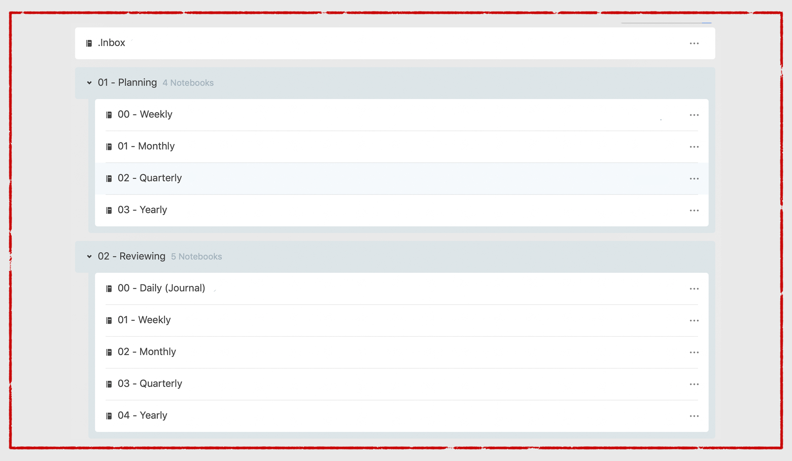
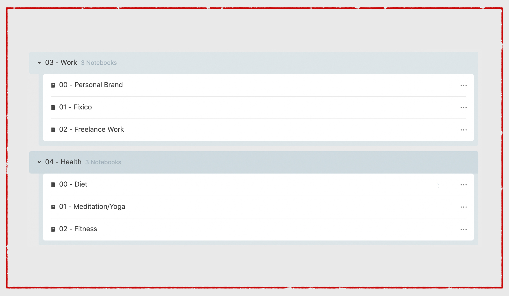
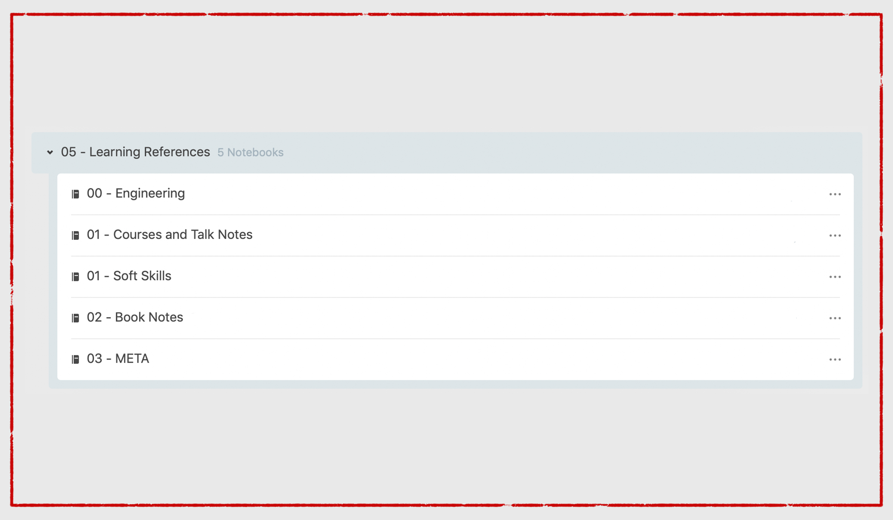
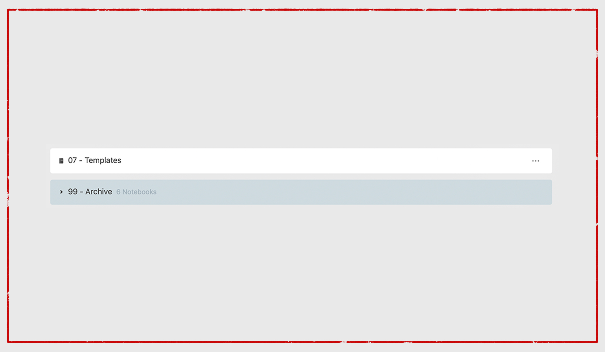

I have been using Evernote for my notes for as long as I can remember. When I got my first real computer I was looking for an application for storing text documents in an orderly manner and, upon a suggestion of one of my professors, I decided to give it a try.
Eight years later, **Evernote** is still one of the most fundamental components of my workflow. Lately, however, I noticed that all these years' material was starting to pile up; that prompted me to redesign my storage system from the ground up.
Today I want to share with you my process for getting from a messy system having lots of misplaced and disorganized notes to a clean, straightforward system that is made for me first.
There are many theories online on how to organize your Evernote data, I spent a couple days reading what I could find on Google ([Michael Hyatt's Tags System](https://michaelhyatt.com/evernote-tags/) was one I found quite appealing) but I quickly realized that it is such a personal piece of software that what would work amazingly for someone might be a total mess for someone else. This is why you should take this blog post with a grain of salt and think about what you want your notes to do for yourself, rather than simply adopting one system over another one.
Introduce data dump as well
The first step in figuring out my system was to understand what kind of data I was going to store in my Evernote so I armed myself of my Apple Pencil and an empty (digital) sheet of paper.

After going through all the notes I already had in my Evernote account and all the handwritten notes both on my iPad and random notebooks, I defined a sort of "hierarchy" of data, which you can see here straight from my brainstorm paper

As you can see, there is a pretty well-defined structure of the data: some well defined macro categories with their subcategories. Once what I wanted to have in Evernote was clear, I tried to implement a system right away using the famous tag system by Michael Hyatt I mentioned above.
Unfortunately, *I quickly realized that, due to how tags are implemented in Evernote, it would not work for me*.
My biggest problem was due to how I like to access my note. Let us look at a practical example which explains well why tags did not work for me.
My job requires a lot of note taking: meeting notes, decision logs, technical analysis and much more. These notes clearly fall into different subcategories, but they are all related by one over-arching category: my job. I would have loved if tags were inheritable, meaning that if I selected a tag, it would also show me all the notes that are tagged with its children tags.
This, unfortunately, is not how tags are handled in Evernote, which forced me to rethink how I was going to handle my system.
After playing around a bit with Evernote’s features, I realized that **what I needed all along were simple notebook stacks in order to divide the data in, then I could use note titles to achieve the data categorization that I needed**.
I then ended up with seven different notebook stacks, each including around three or four (five at most) notebooks inside, plus an “Inbox” notebook and an “archive” stack for filing old documents and notes.
This new hierarchy gave me quick access to everything I might need, notes inside notebooks are titled in a specific way which allows me to easily use Evernote’s built-in search function to easily find whatever I might need at any moment.
I have been using this solution for almost a month now, with very little tweaking needed. It helped me get through moving from my hometown to a different country, it helped me find a house in a very competitive market in record time, and it helped me get back into the weeds of my job after a study vacation of six months at a speed of which I was impressed.
Let us then go through my new system, stack by stack, and look at how Evernote remembers my life for me.

The first notebook you’ll see is my **Inbox**. You can see it is named .Inbox, that is because in this way, thanks to Evernote’s alphabetical sorting, it will always be at the top of my notebooks list, hence super easily accessible. Here go all the notes I create when I am on my computer or on my iPad and I think of something that I want to remember. I do not keep Evernote installed on my phone, so my inbox from there is Google Keep, in which notes might get written in during the day, but from which they are removed every day at night.
You will now see that all my stacks (and my notebooks) are named with a two digit number at the beginning. Once again, this is for organizational purposes, to be sure that I always know where to find what I need, and that I don’t accidentally reorder stuff without realizing it.
The next two stacks are pretty self-explanatory: **Planning and Reviewing** are, well, for planning and for reviewing. As you can see from the notebooks inside, I plan weekly, monthly, quarterly and I recently started planning yearly. Except for the weekly plan, these notes are usually pretty long series of free flow writing that I do at regular intervals (every first day of the month I plan what I want to achieve that month, every first day of every three months I also plan what I want to achieve one quarter), which I started adopting a while ago and which really helped me feel that much more in control of my life. These documents are accompanied by a reviewing note made initially of to-do items which get progressively checked off and which, at the end of the period, allow me to think about how the period went, what could be adjusted etcetera. You will also see a Daily (Journal) notebook, which is where I put all the thoughts I have during the day, what happened to me, what stimulated me and such so that every once in a while I can go back to it and see how single days impact the bigger picture.

Going down the list we see the third stack, named **Work**. This is where I file everything related to my work. This includes this blog and my personal brand in general, including ideas for articles, objectives I want to achieve, talks I want to give and which I already gave, anything of the sort, in the obvious “Personal Brand” notebook. Fixico is the company where I work at, so these notebooks contain everything office-related and of which I was writing some lines above and, finally, “Freelance Work” is where I keep all the details related to other clients, people I might be working with or similar.
The fourth stack is dedicated to **Health**. In the last couple of years at university, I started realizing that I should pay more attention to both my physical and mental health. I never actually got around to making significant progress but when I finished school I decided that this would be one of the highest priorities. I have a diet notebook, where I keep all sort of food-related information (I have been researching fasting a lot lately). I have one notebook called “Meditation/Yoga” which are two tactics I have been researching lately and which I plan to incorporate in my life (although not yet sure if it will be both of them or just one of the two, and which one). Finally, I have my fitness notebook. This includes all the work-out routines I’ve been trying out in the past years, analysis of specific exercises or research about particular routines and how they might be right or wrong for me.

The next stack is called **Learning References**. This is literally the place I go to dump information. Most of the things I know are saved in here. They are easily accessible and organised in such a way that help me always have the right note for the job ready. The first notebook in this stack is for “Engineering” notes: I am a Software Engineering, I have a bachelor’s degree in Computer Engineering and I am in general very interested to the field of engineering itself; I keep here all the notes from school which might turn out to be helpful, I keep notes about information I discover while working which might come up one day in the future, and I keep all my general engineering knowledge, like the note where I started researching how rockets work (Elon, I am coming for you buddy). The following notebook is for “Courses and Talk Notes”; I attend a lot of industry-related events around town, and I take a lot of online courses. It is nice to have a place where the notes from this occasions live in and where they are easily accessible: I might be thinking about that software which was mentioned by the speaker at that specific conference, not being able to recall the name of it, I can just go through the notes from that conference and I will very likely get all the information I was missing. I have a “Soft Skills” notebook, which is mostly empty but which I plan on filling out soon: I have always been interested in psychology, and soft skills in the engineering world are definitely a very important quality, my desire is to merge these two interests, studying psychology to improve my soft skills and, in the end, become an overall better engineer. “Book Notes”, then, is a notebook for, well, book notes. In the last month I picked up the habit of writing down interesting quotes, details or anything of interest from non fiction books on a small notebook I carry around with me at all times. All these notes, then, end up typed and stored in this notebook. Finally, the “META” notebook is about me trying to become a better learner: I always struggled with learning-related problems, I would get distracted easily, procrastinate a lot and many problems which are experienced by University students. I got a lot better at it and it is mainly thanks to all the material in this notebook.

This has been a long article so far, I understand that, but hold on with me for just a couple more notebooks, I swear I will be done soon.

The last “actual” notebook stack is my **Personal** stack. I could probably write a whole blog post about what I keep in these notebooks, but that I will do maybe another time. Let us go through the four notebooks stored here. The first notebook you will see is a “Misc” notebook: here I have been keeping just some notes which did not have a true place to go, I have the list of all the must-have software that is installed on my laptop, I have a “quote book” of quotes which I find interesting, and many similar notes. The next notebook is for Recipes and Cooking: I love cooking even though I do not practice it as much as I should, but I love getting recipes from my mother, saving them here and then trying them out for special occasions. Finally, "Travel Plans" is for planning all my travels: work related, school related, holidays, anything that involves leaving the house for more than a night is saved in here.

The last two items on the list are a **Templates** notebook, where I keep all sort of templates, from the one I am using to write this post to my “Weekly Review” template and so on.
And, finally, **Archive** is where old notebooks go to: I have here all the notebooks I used in the past for classes, old projects etcetera. Sometimes it is useful but I would be a liar if I said that I regularly access this stack.

And that is all I have to say about my Evernote set up. Like I said above, take it with a grain of salt as my needs are probably different from yours, and maybe my needs in six months will be different from my needs to say and this might all go away, but feel free to take inspiration from my post and adapt it to your workflow in order for it to help you achieve what you want to achieve.

Never forget, however, that Evernote should be at your service and not the other way around: you need to find a way for it to be helpful, but do not spend a whole month on it, you might be defeating its purpose in this way!

If you want to know more about anything that I have written in this article, feel free to get in touch with me on social media, by sending me an email or however you’d like. All my contact information are either on the side of this article or on my website.

Have a nice day!

Pietro
