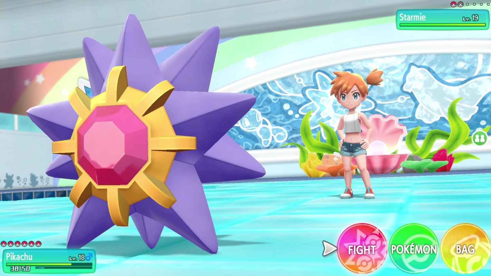

I've been a Pokémon player for the last 20 years of my life, that is, basically my whole life. One of the main points in favor of buying my Nintendo Switch was the fact that there would be new Pokémon games coming out for it. Now I did not expect to wait exactly one year since getting my Switch (I bought during at last year's Black Friday) but here it finally is, **Pokémon Let's Go: Pikachu**, the first iteration of the main Pokémon franchise on the Nintendo Switch, and it is absolutely mind-blowing.

I haven't looked forward to a weekend release of a game in a long time. I can't remember the last time I bought the game on launch date and spent the weekend playing it, going through the story and being completely absorbed by its world. This is what happened to me with Pokémon Let's Go.

Now I'm not here to describe how this game feels and can be experienced, there are people out there who are much better at writing about that kind of stuff than me, just dig around websites like Polygon and you will get all the information you need about what the game is and how it came to be. What I want to do here, instead, is discussing the highlights and the shortcomings of this game, as I experienced them playing it, and taking a look at where the Pokémon Company can go from here, since we know there will be an eight generation Pokémon game coming to the Switch pretty soon.

Without hesitation, let's get into the golden nuggets of this game. Note that their order is the same order that I encountered them in the game. I haven't finished the game so I might be missing some details but bear with me.

## The New Random Encounter System

Pokémon Let's Go introduces a new random encounter system. Interacting with wild Pokémon does not happen randomly as you are walking through *tall grass* or other sections of the world where encounters are possible. In this new game wild Pokémon spawn in these areas, but you are able to see them and you are able to decide whether or not you want to get into a specific encounter. Once one of these *battle* starts, you are presented a new interface highly inspired, to put it mildly, by the Pokémon Go interface. There is no more fighting wild Pokémon but only catching them in a Pokémon Go-like environment. Every Pokémon you catch in wild encounters gives you experience and not only to the first Pokémon in your party but to your whole "squad".

I will now make a lot of people leave this article but let me just say, I LOVE this system. There are a couple of things that bother me and which I will analyze in a second but the way in that they basically reduced the grinding for experience to the minimum is amazing to me. When I was younger I always remember playing with only my starter: I would always fight with him and rarely use the other Pokémon I caught. This always resulted in me getting to a point in the game where I had to go back to lower level areas and grind experience for the other Pokémon I neglected when going through the story. This always frustrated me and it is something that they got rid of in Pokémon Let's Go. Yes, using a Pokémon to fight will always result in that Pokémon being of higher level, but sharing the experience with all your party will always result in a somewhat balanced team for most of the game.

## Gyms and the Fighting Interface

Game Freak did not completely forget that, at its heart, Pokémon is a turn-based fighting game. From the very first game 22 years ago and through all the various games and spinoffs, the core of every Pokémon game has been having the little monsters fight each other. Pokémon Let's Go remains true to its origins but tries to improve on them as much as possible. Every fight is fully animated, in three dimensions and with dynamic camera movement panning from the Pokémon to the trainers and back, every move has its own animation which can go from a small ray of fire (Ember) to a Pokémon being launched outside of the orbit of the planet and left it there to fall down (Seismic Toss). The way that these battle are played reminded me of the battles in Pokémon Colosseum on the GameCube, but with immensely better graphics.

Gyms too have been highly curated: a lot of attention has been put into every detail of the buildings where you get your Badges in order to best express the details of the Gym Leader residing in them.

The graphics, the interactivity and the environment in which these battles are fought really draw you into the game leaving you with a desire of more and more fights against trainers of every kind.

## The Graphics

There it is: the most dreaded argument when talking about video games, their graphics. Does Pokémon Let's Go have super realistic graphics that should make you forget you are playing something on a screen? No. Are Pokémon Let's Go graphics good? Yes, I would go as far as to say that they look amazing.

Nintendo made a smart move marking itself as the company that makes video games in this cartoon-ish style because it allows them to have an undeniably less powerful console with respect to its competitors (PS4 and Xbox), but at the same time it allows them to produce games such as Legends of Zelda: Breath of the Wild, Super Mario Odyssey, and Pokémon Let's Go which might not be super realistic, but still look stunning both when you are playing handheld and when you dock the Switch and play on a big screen.

Obviously then, Pokémon Let's Go is not the best looking produce of the video game industry, but its art style and the story that it is trying to convey simply work together, creating a product that is easy to enjoy and can totally transport you in another dimension.

## The other stuff

There are a couple more quality of life improvements that Nintendo made and which I really appreciated.

The first of one being the elimination of the Pokémon Box system. Since you are now catching Pokémon instead of killing them for experience, you are going to end up with an increasingly large amount of Pokémon with you. When you reach your party limit, however, (still six Pokémon in case you were wondering) the Pokémon are not sent to a Box like they used to, but they are stored in a specific category in your inventory. No need of going back to a Poké Centre to change the composition of your party: you can now do it on the fly and with few button clicks. Moreover, you can send Pokémon which you don't need anymore to Professor Oak in exchange for stat boosting candy which you can give to your Pokémon in order to increase their statistics.

The other improvement I really enjoyed was the rework of the HM/TM system. In Pokémon Let's Go, HMs such as Cut or Flash are not battle actions anymore. Rather, they are **special skills** which are learned by Pikachu as you progress with the story and which Pikachu can perform any time they are needed outside of combat. TMs, on the other hand, work similarly to how they did before, with the one exception that they are not single-use anymore: once you get a TM, you can teach it to as many Pokémon as you want to, as long as they are able to learn the move you want to teach them.

---

That was enough good things about this game, for now. As much as I would love it to be, Pokémon Let's Go is by no means a perfect game. Let us leave the discussion of what a perfect video game is for another day and allow me to introduce what I found not-too-awesome about this seventh generation Pokémon which Nintendo just released. Once again, these points are in the same order as I encountered them while playing the game.

## The text

RPGs tell stories. It's one of the reasons why we play RPGs, because we are interested in the story. Pokémon Let's Go tells the story of a young child who becomes a Pokémon trainer first and the champion of the Pokémon league after. This has always been what Pokémon is about but I still feel like that in this iteration there is just way too much text, and it is too slow, thus causing havoc in the immersion with the game.

Every time I start a Pokémon game, one of the first actions is always to go in the Menu and set the text speed to the highest available. I did this little tweak also with Pokémon Let's Go, but I still feel that there is too much time wasted in text boxes conveying information which could be conveyed in a much better way. The main place where this happens is after a battle of catching a Pokémon. All your team gets a bunch of XP points and it might often happen that more than one Pokémon levels up as a result. When this happens there is so much text going across the screen that it seems like forever has passed when you are thrown back into the game.

Maybe this could be solved by allowing the user to select an "Experienced" version of the text, which reduces information displayed to the bare essentials, I do not know I am not a Game UX designer, but I still feel like something better could have been done.

## Pokémon Battles

As we said earlier, Pokémon battles are at the core of Pokémon games, and they look amazing in this iteration. The problem, however, is that there is too few of them.

Most trainers you will find around the world will have only one Pokémon, making it easy to fight them with your six Pokémon team all relatively around the same level. Gym Leaders might be a little harder to defeat but if you maintained your team composition under control and you know what you are doing most of the battles are very easy. Once again, I am not that far into the game right now, I have defeated three gyms and there are still many people I will have to fight, but so far it hasn't been impressive on any level.

## The Controls

Once again, I am no Game UX Designer, but neither is whoever thought of the controls for this game, then.

There are three main ways of playing Pokémon Let's Go, in handheld mode, with the Switch docked and **one** JoyCon, and with the Switch docked and using the Poké Ball Plus a purpose-built controller for playing Pokémon Let's Go. I do not have the latter so I cannot speak about it, but I want to complain about a couple of details. Catching wild Pokémon requires you to launch your Poké **B**all in a Pokémon-Go fashion by performing the launching motion with the JoyCon in your hand. The main problem is that your motion and the resulting Poké Ball launch often seem completely unrelated, like the JoyCon was completely miss calibrated. Now this problem does not exist in handheld mode because to launch the Poké Ball in the latter situation you just need to press A at the right moment, making it very much easier. I wish they allowed the option to use this method even when the Switch is docked, maybe let people play this way using a Pro Controller (which, by the way, is not supported).

One more point I want to analyze is the playing with only one JoyCon part: it feels weird! It is not like playing Mario Kart, which you can play with only one JoyCon holding it horizontally; you play Pokémon go using the Joycon as you were using both of them, but everything happens on the one. This, in theory, is great: you basically need three buttons to play Pokémon Let's Go, so one JoyCon is more than enough with its seven buttons, but it does still feel slightly weird when actually playing.

---

First weekend, about 10 hours in, these are the major points of the seventh generation of Pokémon games. So what do I think about it? I feel like this game will be for the younger generations what the first Pokémon Red was for us: a gateway into a universe so fantastic and full of discoveries and stories which will accompany the new generation of video gamers for the next 20 years, and I also feel like it is a way to welcome back those people who grew up with the franchise and who have lost the desire for the grinding, who don't want to spend hours and hours perfectly training their Pokémon to be the very best.

I do feel like that with this game Game Freak more or less abandoned the competitive side of the series. We will have to see how the game evolves, but I do not feel that in the day and age of eSports becoming a some-what mainstream phenomenon, this video game is the right way to introduce Pokémon to the eSports mass market. And this disappointed many people. But I feel like that Game Freak can build a lot on top of the foundations they laid with this Pokémon Let's Go, and I am very excited to see what they have in store.

Finally, let me say goodbie with this little nugget you can find in Pallet Town:

<blockquote class="twitter-tweet" data-lang="en">
Pokémon, 20 years apart. Technology is indeed incredible. <a href="https://t.co/1nIMhRH002">pic.twitter.com/1nIMhRH002</a>
&mdash; Federico Viticci (@viticci) <a href="https://twitter.com/viticci/status/1063228874820075520?ref_src=twsrc%5Etfw">November 16, 2018</a></blockquote>

